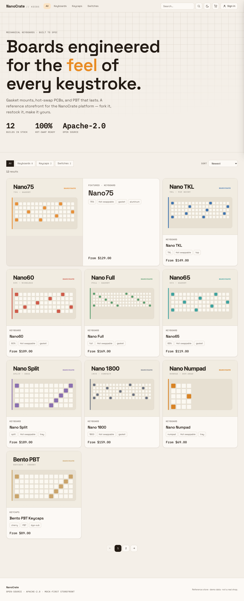
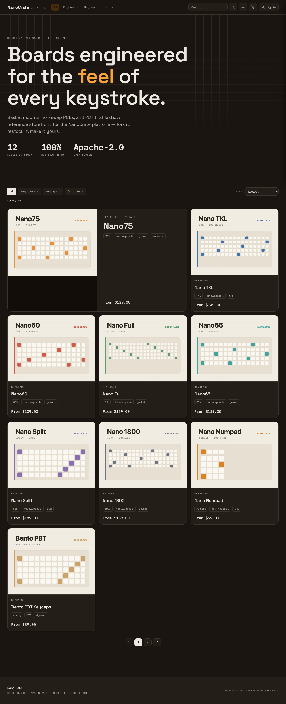
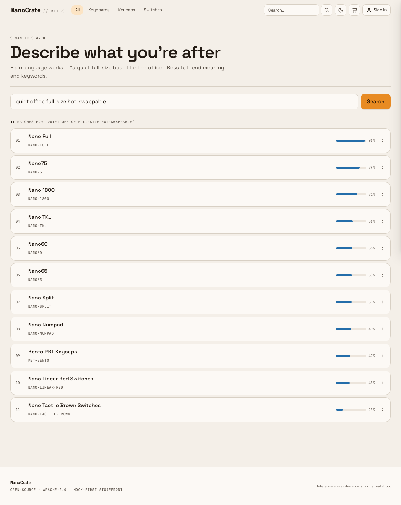
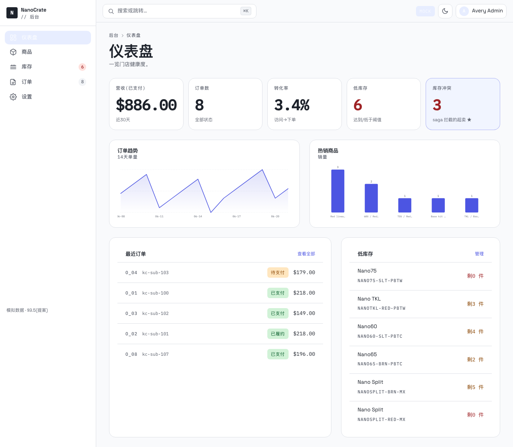

# NanoCrate · Frontend

A **React + TypeScript + Vite** storefront for the [NanoCrate](../README.md) platform,
built **mock-first**: the UI is developed and tested entirely against [MSW](https://mswjs.io)
mocks that mirror the backend contract, so no backend is required to run it.

> Contract source of truth: [`../docs/backend.md` §9](../docs/backend.md). UI conventions:
> [`../docs/frontend.md`](../docs/frontend.md).

**▶ Live demo:** _coming soon_ — `https://<live-demo-url>` _(static deploy, mock mode; replace when published)._

### Screenshots

| Storefront (light) | Storefront (dark) |
|---|---|
|  |  |

| Semantic search | Admin console (indigo, 简体中文) |
|---|---|
|  |  |

_These are the committed visual-regression baselines (`pnpm test:visual`), captured at 320–1440 across both themes._

## Phase 1 scope

Skeleton + product catalog (mock-first):

- Design system with CSS-custom-property tokens (`src/styles/tokens.css`) mapped onto Tailwind v4.
- Typed API client (`src/services/api.ts`) — envelope unwrapping, Zod validation, normalized
  `ApiError`, `Authorization: Bearer`, and `Idempotency-Key` on checkout. Components never `fetch`.
- MSW handlers (`src/mocks/`) mirroring `/product-types`, `/products`, `/products/:slug`, `/search`,
  with mechanical-keyboard fixtures.
- TanStack Query hooks (`useProducts`, `useProduct`, `useProductTypes`) + React Router.
- **Catalog** page: category filter, sort, and pagination driven by URL search params, with skeletons.
- **Product** page: variant picker where price and availability follow the selected variant.
- Accessibility (semantic HTML, keyboard reachable, reduced-motion) and responsive 320–1440.

## Phase 2 scope

Cart → checkout (Stripe) → orders (mock-first):

- **Cart**: slide-over `CartDrawer` + `/cart` page; add / update / remove with **optimistic updates**
  (snapshot → update → rollback + visible error), reconciled with the server's latest cart (§9.4).
- **Checkout**: `/checkout` with an order summary. Live mode renders the real Stripe **Payment Element**
  (`@stripe/react-stripe-js`) → `POST /checkout` (with `Idempotency-Key`) → `confirmPayment({ return_url })`.
- **Result**: `/checkout/result` **polls the order status** to decide success — never assumed from the
  redirect (SPEC §7) — with clear `out_of_stock` and `payment_failed` UX.
- **Orders**: `/orders` list + `/orders/:id` detail (snapshot line items), behind auth.
- **Auth**: Keycloak (`keycloak-js`, OIDC + PKCE) in live mode; access token kept in memory only.
  Checkout → result → orders are protected routes; the cart stays public for guests (session per §9.2).

### Mock vs live (important boundary)

In **mock mode** there is no Stripe or Keycloak server, so:
- a **stand-in payment panel** with a *simulate result* control (succeeds / fails / out-of-stock) replaces
  the real Payment Element;
- the mock backend returns a **fake `client_secret`**, and a **mock-only** `POST /mock/confirm-payment`
  endpoint + `X-Mock-Outcome` header stand in for the Stripe webhook (a real backend ignores both);
- a one-click **demo sign-in** replaces the Keycloak redirect.

A real end-to-end payment requires **live mode + a backend + a Stripe test publishable key** — set
`VITE_API_MODE=live`, `VITE_STRIPE_PUBLISHABLE_KEY`, and the `VITE_KEYCLOAK_*` vars (see `.env.example`).

## Phase 3b scope — admin console + dark theme + component library

- **Dark theme**: a full `[data-theme="dark"]` token set (warm charcoal); `ThemeProvider` resolves
  light/dark/system, persists only the **UI preference** (never the token), honors
  `prefers-color-scheme`, with a no-FOUC pre-paint script. **Both themes are WCAG-AA verified.**
- **Component library** (`src/components/ui/`): Spinner, Button (+danger/loading), IconButton,
  FormField + Input/Select/Textarea/Checkbox, Modal/ConfirmDialog (focus-trapped), Toast (aria-live),
  DataTable (sort/bulk/row-actions/keyboard rows), Tabs — all states, steel-blue focus, token-only.
- **Admin console** (`/admin`, **简体中文**, scoped Stripe-**indigo** skin): RBAC gate (`AdminRoute`),
  sidebar/topbar shell, **⌘K command palette**, Dashboard (KPIs incl. a **stock-conflict** metric +
  token-themed SVG charts), Products with a **★ schema-driven dynamic attribute form** + **★ variant/SKU
  matrix editor**, Inventory with an **★ append-only stock ledger**, and Orders with a status timeline.
  Aligned to **`docs/backend.md` §9.5**; admin code is lazy-loaded off the storefront landing bundle.

## Phase 4 scope — semantic search

- `/search?q=` runs a semantic + keyword hybrid search (`POST /search`, §9.3) with relevance-ranked
  results, loading/empty/error states, and example-driven suggestions; the header search submits here.
  The mock expands natural-language terms through an attribute synonym map for a demoable ranking.

## Design direction

*Industrial spec-sheet / technical editorial.* Warm paper light base (no default dark mode),
near-black warm ink, a confident **amber** brand accent plus a **steel-blue** interactive accent,
and **monospace (IBM Plex Mono)** reserved for technical data (SKUs, specs, prices). The catalog
uses a grid-breaking editorial layout rather than a uniform card grid; hover / focus / active states
are deliberately designed and animate only compositor-friendly properties.

## Prerequisites

```bash
node -v   # >= 20  (developed on 22)
corepack enable && corepack prepare pnpm@latest --activate
```

## Getting started

```bash
pnpm install
cp .env.example .env.local
pnpm dev                 # http://localhost:5173 — mock mode by default
```

Switch to a real backend in `.env.local`:

```ini
VITE_API_MODE=live
VITE_API_BASE_URL=http://localhost:8080/api/v1
# Live-only (Phase 2): real Stripe + Keycloak
VITE_STRIPE_PUBLISHABLE_KEY=pk_test_...
VITE_KEYCLOAK_URL=http://localhost:8081
VITE_KEYCLOAK_REALM=nanocrate
VITE_KEYCLOAK_CLIENT_ID=storefront
```

## Scripts

| Script | Purpose |
|---|---|
| `pnpm dev` | Vite dev server (mock mode) |
| `pnpm build` | Typecheck + production build |
| `pnpm typecheck` | `tsc --noEmit` for app + config |
| `pnpm test` | Vitest unit/integration (runs against MSW) |
| `pnpm test:coverage` | Vitest with coverage |
| `pnpm test:e2e` | Playwright functional e2e (mock mode, deterministic; excludes `@visual`) |
| `pnpm test:visual` | Playwright visual-regression baselines (`@visual`; platform-specific) |
| `pnpm test:e2e:install` | Install the Playwright browser |
| `node scripts/generate-images.mjs` | Regenerate SVG product placeholders |
| `node scripts/screenshots-phase2.mjs` | Drive the purchase flow + capture breakpoint screenshots |

## Architecture

```
src/
  auth/          AuthContext (mock + Keycloak) · ProtectedRoute
  services/      api.ts (typed client) · types.ts (Zod contract) · query-client.ts · auth-token.ts
  mocks/         handlers.ts + store.ts (cart/orders state) + browser/server + fixtures/
  hooks/         useProducts · useProduct · useCatalogParams · useCart · useCheckout · useOrders
  lib/           format · cart (optimistic helpers) · productImage · env · cn
  components/    ui/ · layout/ · catalog/ · product/ · cart/ · checkout/ · order/
  routes/        CatalogPage · ProductPage · CartPage · CheckoutPage · CheckoutResultPage · OrdersPage · OrderDetailPage
  styles/        tokens.css · typography.css · global.css
```

- All catalog state (type / query / sort / page) lives in URL search params — shareable and
  back/forward friendly.
- Auth tokens are held in memory only (never `localStorage`) per the security guidance.
- Stripe.js and `keycloak-js` are dynamically imported so they stay out of the main bundle (and out of
  the mock build entirely).

## Contract notes (flag for backend)

- **`/product-types` payload** is not pinned by §9; modeled from the SPEC §5 DDL (`key`, `name`)
  plus an optional `product_count` convenience.
- **`GET /products/:slug`** (§9.3) returns no `image` field; the detail page derives media from the
  slug as a documented fallback. A real implementation should add product media to the contract.
- **Mock-only additions** (not part of the contract; flagged for clarity): the `X-Mock-Outcome` header on
  `POST /checkout` and the `POST /mock/confirm-payment` endpoint exist purely to simulate the async Stripe
  webhook in mock mode. A real backend ignores them and decides payment via the webhook (SPEC §7).
